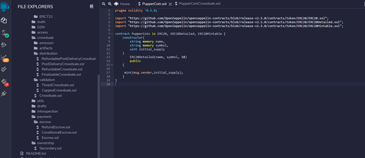
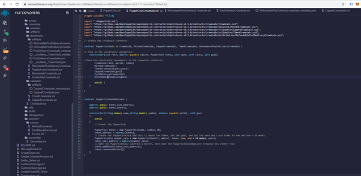
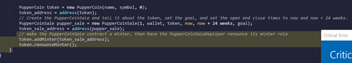
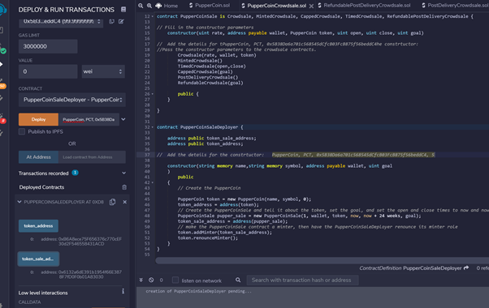
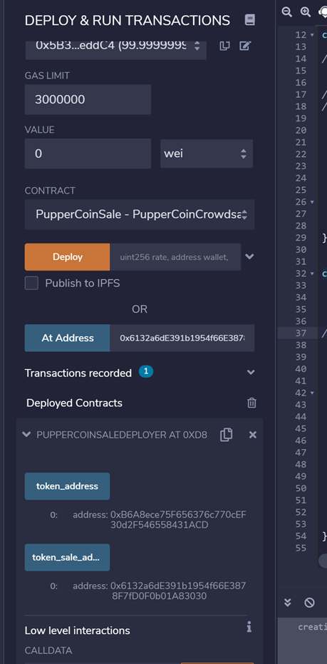
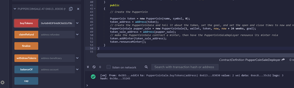
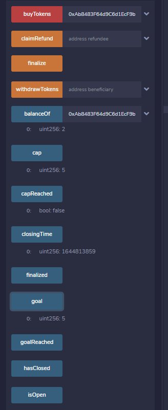
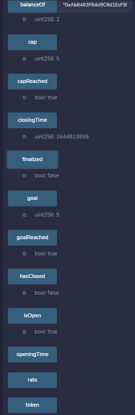

# Week_21_Assignment

# Puppercoin - Decentralizing Dog Breeding

Pupper has decided to crowdsale their PupperCoin token in order to help fund the network development. 
A maximum of 300 Ether is to be raised and a refund will be required if the crowdsale is successful and the goal is met.
The crowdsale will run for 24 weeks.

## Creating the Crowdsale Contract

The Crowdsale contract is created within Remix using Solidity language, ERC20 standard and and blockchain application OpenZepplin to help build and execute the contracts.

Two steps of coding was required to deploy the Crowdsale and receive funding from 3rd parties.

1.Puppercoin.sol to create the standard ERC20Mintable token - Image 1

2. PupperCoinCrowdsale.sol to create and deploy the PupperCoinSale Contract, and execute the sales - Image 2.

The first lines of code (Image 2) access the OpenZeppelin packages that will be utilised in executing the contract. *Crowdsale
* MintedCrowdsale
* CappedCrowdsale
* TimedCrowdsale
* RefundablePostDeliveryCrowdsale

These are then seen within contracts on the left panel and later in drop down menus when they are utilised.

Parameters for the Crowdsale Deployer,include the name , symbol , wallet for fundraising as well as the goal A  rate of 1, to maintain parity with Ether units rate. 
In addition RefundablePostDeliveryCrowdsale inherits the RefundableCrowdsale contract, and a goal parameter - this is 300 for the Crowdsale although 5 was used in testing the software.
As set out in the requirements there is an opening time of now and closing within 24 weeks.

The final coding sets the minter so that othe PupperCoinSale3 contract is the only minter of coins and thet revoke the capability of the token to mint new coins - Image 3.

## Deploying the Crowdsale Contract

Using the JavaScript VM(London) Environment, and in PupperCoinSale Deployer, the Contract was Deployed using coins within MyCrytpo address, a token symbol of PCT and a tetsing limit of 5 Etgher - Image 4.

The subsequent address for the token sale is listed in teh new contract (Image 5), which we can then deploy in the first sale (Image 6)

With a limit set at 5 a purchase of 2 was successfully made from  account  0xAb8483F64............2 (Image 7
But at this stage the goal had not been met.
Using the same process but a different contributer address, another sale of 3 was executed and the goal reached. These Image 7 to view notifications opf completion of the Crowdsale. Note that  for testing the 
timeframe was changed from Now to Now = 2 minutes but this did not appear to register in the sysytem (Image 8) so the contract did not reconise the closure of the sale.

 

  